# hse23_hw2_chip 

Ссылка на блокнот с кодом: https://colab.research.google.com/drive/12qyRwOjCGiaiY8ziO-7Msr4puW20_E7x?usp=sharing 

Для исследования была выбрана клеточная линия HeLa-S3 и гистоновая метка H4K20me1

## Скриншоты работы fastqc на исходных последовательностях: 

### 1-ая ChipSeq реплика - ENCFF000BDM
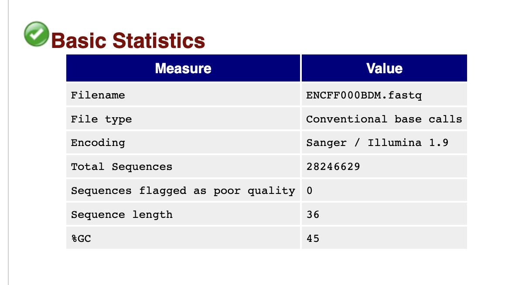
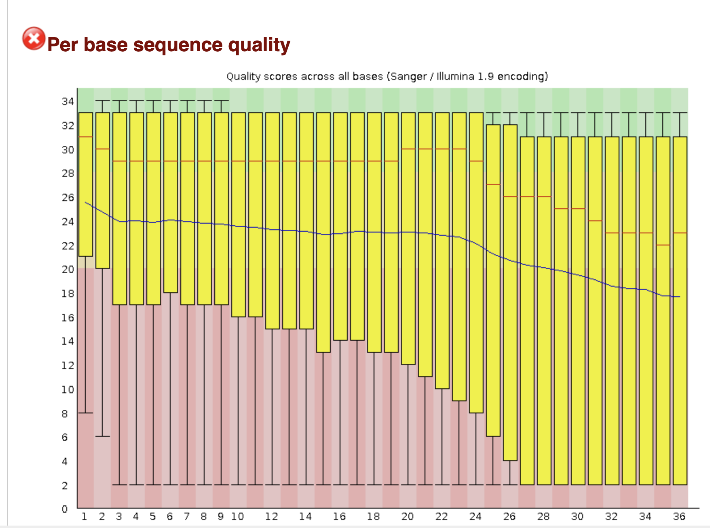

### 2-ая ChipSeq реплика - ENCFF000BDR

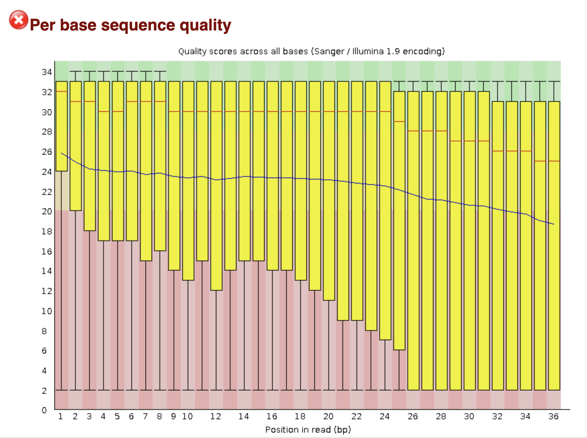

### Контроль - ENCFF000BAO
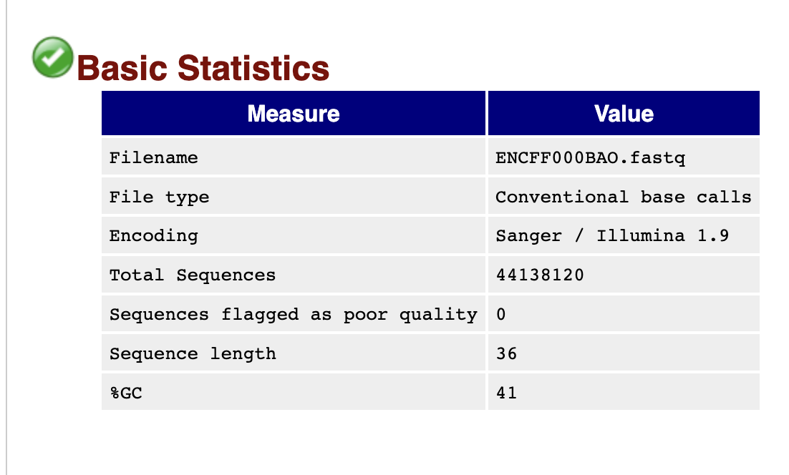
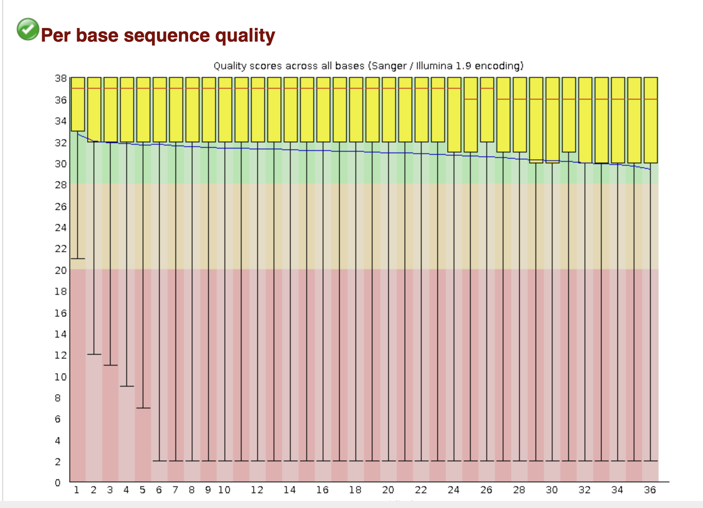

## Подрезал их как в примере, чтения улучшились: 

### 1-ая ChipSeq реплика - ENCFF000BDM

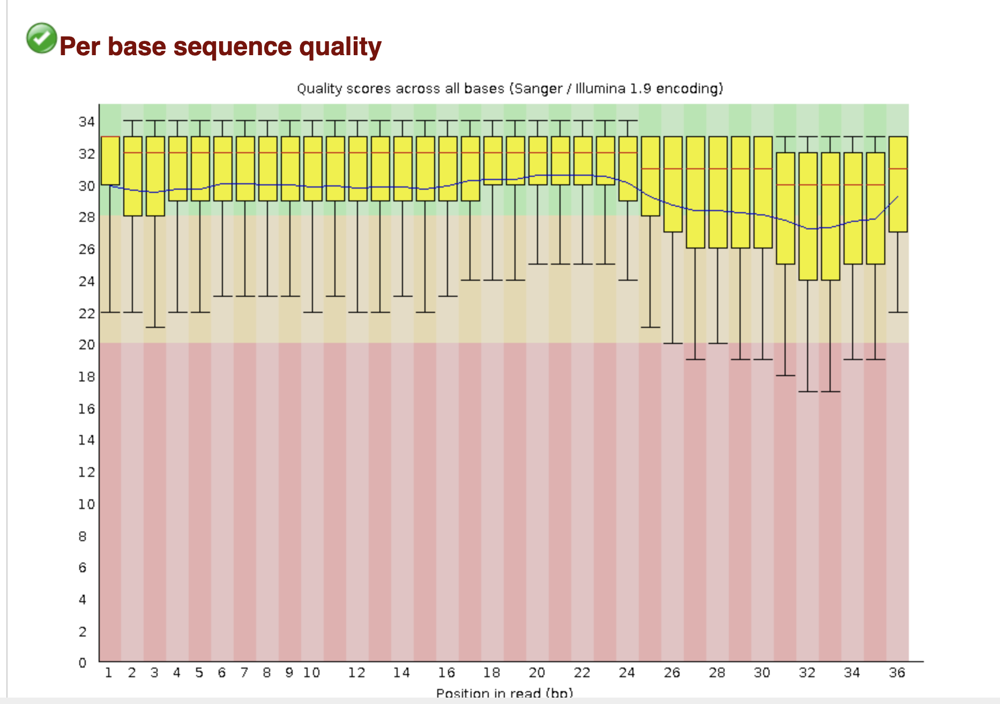

### 2-ая ChipSeq реплика - ENCFF000BDR
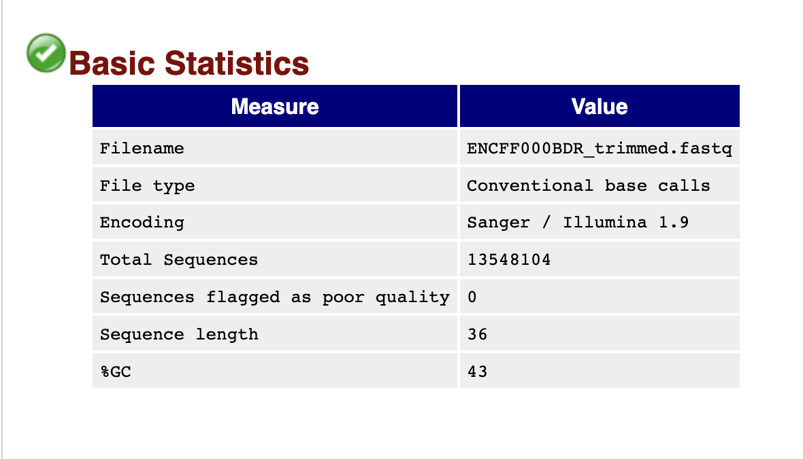
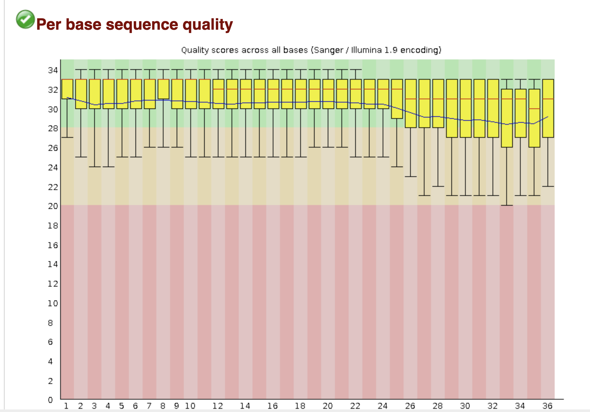

### Контроль - ENCFF000BAO

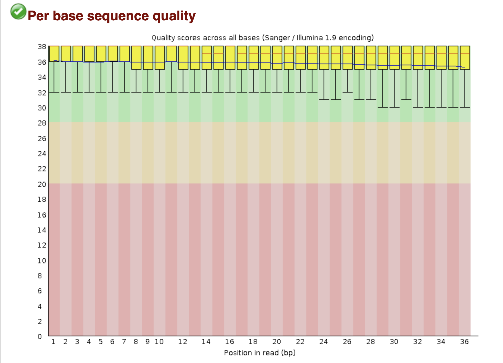

## Таблица со статистикой по выравниванию на 16 хромосому

| ID          | Общее число ридов | Выровнено уникально | Выровнено уникально (%) | Выровнено неуникально | Выровнено неуникально (%) | Не выровнено | Не выровнено (%) |
|-------------|--------------------|----------------------|---------------------------|------------------------|-----------------------------|--------------|-------------------|
| ENCFF000BDM | 13775985           | 565416               | 4.10%                   | 1983909              | 14.40%                     | 11226660     | 81.49%            |
| ENCFF000BDR | 13548104           | 581617               | 4.29%                   | 2117530              | 15.63%                     | 10848957     | 80.08%            |
| ENCFF000BAO (контроль) | 36013843           | 1386072              | 3.85%                   | 5206052              | 14.46%                     | 29421719     | 81.70%            |

Мы выравнивали последовательности на одну хромосому, которая составляет малую часть генома человека. Поэтому процент выравниваний и получился таким низким. Выровнять на все не хватает вычислительных мощностей google colab.

## Диаграммы Эйлера-Венна

### Для первой последовательности 
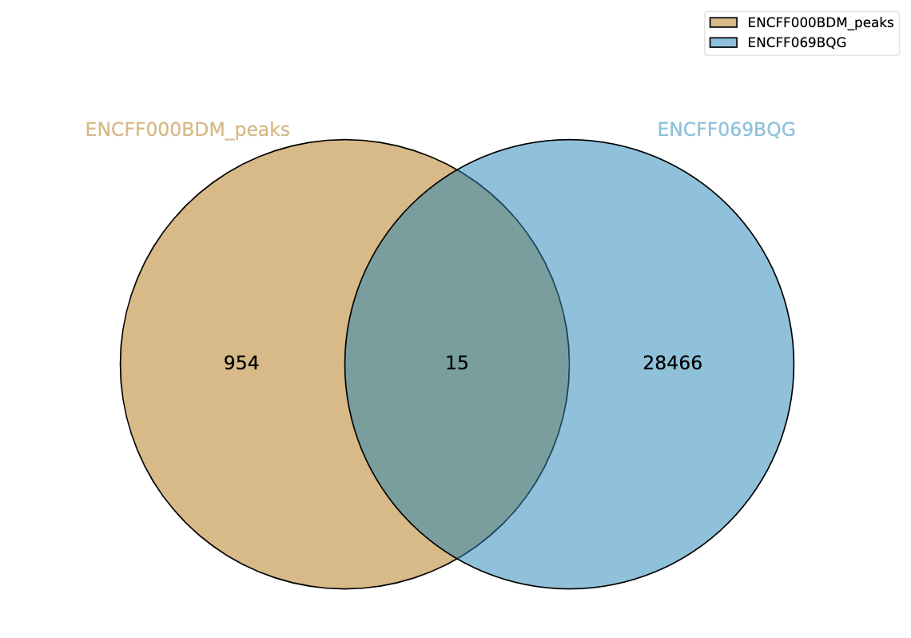
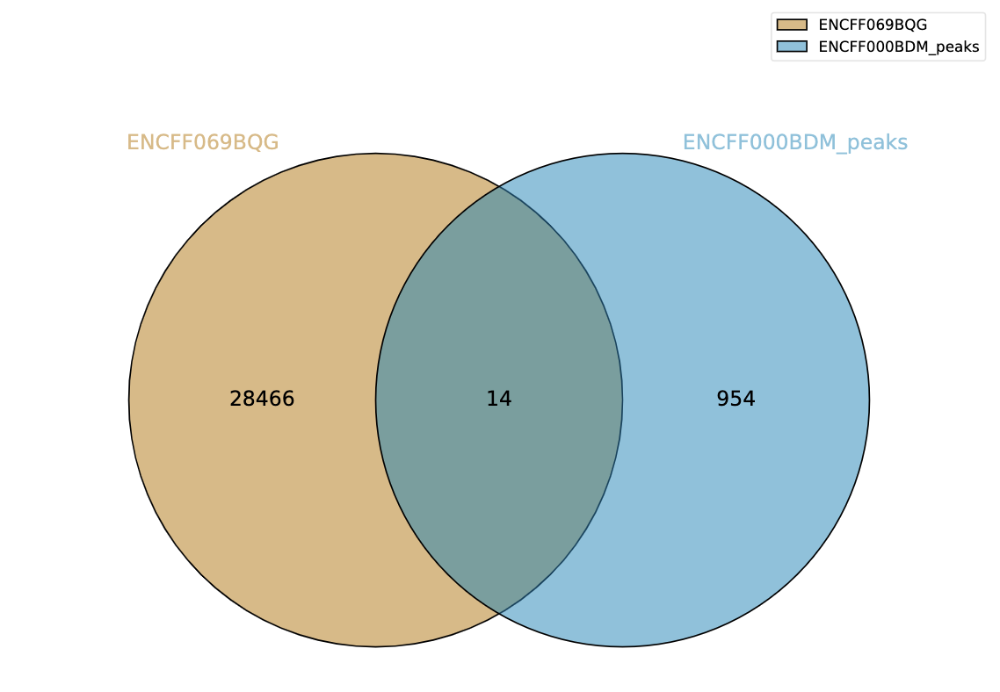

### Для второй последовательности 

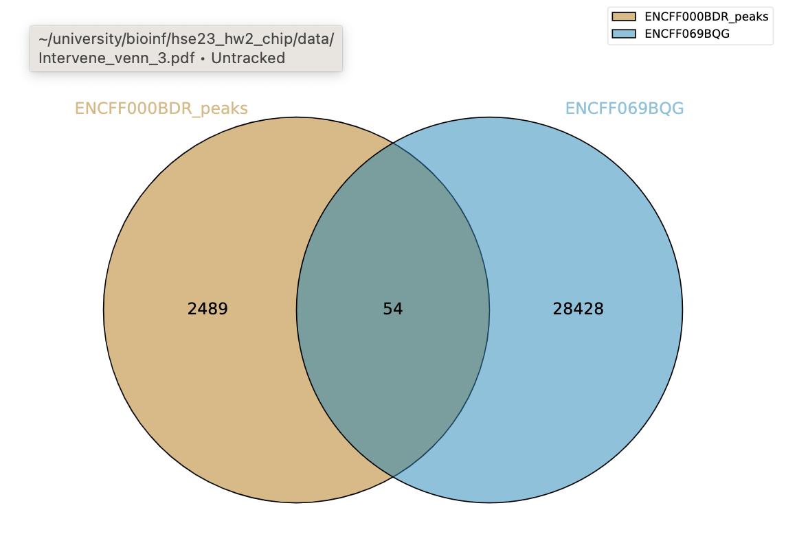
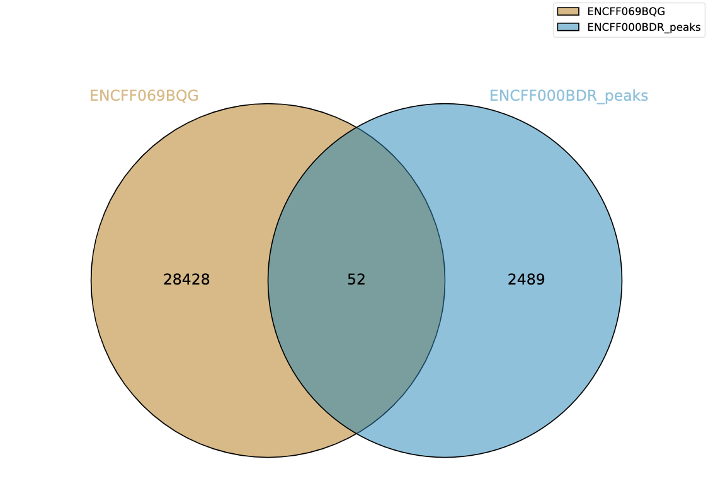

Пересечений мало, потому что выравнивание производилось только на одну хромосому. В базе данных ENCODE пики составлены для всех хромосом, поэтому их больше.

